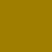

# Decomoji Colors

[デコモジ](https://github.com/decomoji/slack-reaction-decomoji)で使われている12色のカラーセットです。

| chip | name | HEX  | RGB  | HSL  |
| ---- | ---- | ---- | ---- | ---- |
|  | tomato | `dd3b40` | `240,59,64` | `358,86,59` |
|  | chocolate | `c05b2c` | `192,91,44` | `19,63,46` |
|  | gold | `9f7e00` | `159,126,0` | `48,100,31` |
|  | olive | `688200` | `104,130,0` | `72,100,25` |
|  | forest | `008c22` | `0,140,34` | `135,100,27` |
|  | teal | `008780` | `0,135,128` | `177,100,26` |
|  | cerulean | `0081b1` | `0,129,177` | `196,100,35` |
|  | denim | `477f9b` | `71,127,155` | `200,37,44` |
|  | danube | `5d79aa` | `93,121,170` | `218,31,52` |
|  | lavender | `a156d2` | `161,86,210` | `276,58,58` |
|  | azalea | `d43892` | `212,56,146` | `325,64,53` |
|  | coral | `a36969` | `163,105,105` | `0,24,53` |

## HEX Color

```
#dd3b40
#c05b2c
#9f7e00
#688200
#008c22
#008780
#0081b1
#a36969
#5d79aa
#a156d2
#d43892
#477f9b
```

## RGB

```
rgb(240, 59, 64)
rgb(192, 91, 44)
rgb(159, 126, 0)
rgb(104, 130, 0)
rgb(0, 140, 34)
rgb(0, 135, 128)
rgb(0, 129, 177)
rgb(163, 105, 105)
rgb(93, 121, 170)
rgb(161, 86, 210)
rgb(212, 56, 146)
rgb(71, 127, 155)
```

## HSL

```
hsl(358, 86, 59)
hsl(19, 63, 46)
hsl(48, 100, 31)
hsl(72, 100, 25)
hsl(135, 100, 27)
hsl(177, 100, 26)
hsl(196, 100, 35)
hsl(0, 24, 53)
hsl(218, 31, 52)
hsl(276, 58, 58)
hsl(325, 64, 53)
hsl(200, 37, 44)
```

## ファイル形式

下記のファイル形式を用意しています。

- [.json](DecomojiColors.json)
- [.js](DecomojiColors.js)
- [.ts](DecomojiColors.ts)
- .csv（[HEX](DecomojiColorsHEX.csv), [RGB](DecomojiColorsRGB.csv), [HSL](DecomojiColorsHSL.csv)）

また、TypeScript 向けに[型定義](DecomojiColorsTypes.ts)もあります。

## ライセンス

[MIT](LICENSE).