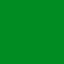

# decomoji-colors

[デコモジ](https://github.com/decomoji/slack-reaction-decomoji)で使われている 12 色のカラーセットです。

| chip                                       | name      | HEX      | RGB           | HSL          |
| ------------------------------------------ | --------- | -------- | ------------- | ------------ |
|        | tomato    | `dd3b40` | `221,59,64`   | `358,86,59`  |
|  | chocolate | `c05b2c` | `192,91,44`   | `19,63,46`   |
|            | gold      | `9f7e00` | `159,126,0`   | `48,100,31`  |
|          | olive     | `688200` | `104,130,0`   | `72,100,25`  |
|        | forest    | `008c22` | `0,140,34`    | `135,100,27` |
|            | teal      | `008780` | `0,135,128`   | `177,100,26` |
|    | cerulean  | `0081b1` | `0,129,177`   | `196,100,35` |
|          | denim     | `477f9b` | `71,127,155`  | `200,37,44`  |
|        | danube    | `5d79aa` | `93,121,170`  | `218,31,52`  |
|    | lavender  | `a156d2` | `161,86,210`  | `276,58,58`  |
|       | azalea    | `d43892` | `212,56,146`  | `325,64,53`  |
|         | coral     | `a36969` | `163,105,105` | `0,24,53`    |

## HEX

```
#dd3b40 // tomato
#c05b2c // chocolate
#9f7e00 // gold
#688200 // olive
#008c22 // forest
#008780 // teal
#0081b1 // cerulean
#477f9b // denim
#5d79aa // danube
#a156d2 // lavender
#d43892 // azalea
#a36969 // coral
```

## RGB

```
rgb(221, 59, 64)   // tomato
rgb(192, 91, 44)   // chocolate
rgb(159, 126, 0)   // gold
rgb(104, 130, 0)   // olive
rgb(0, 140, 34)    // forest
rgb(0, 135, 128)   // teal
rgb(0, 129, 177)   // cerulean
rgb(71, 127, 155)  // denim
rgb(93, 121, 170)  // danube
rgb(161, 86, 210)  // lavender
rgb(212, 56, 146)  // azalea
rgb(163, 105, 105) // coral
```

## HSL

```
hsl(358, 86, 59)  // tomato
hsl(19, 63, 46)   // chocolate
hsl(48, 100, 31)  // gold
hsl(72, 100, 25)  // olive
hsl(135, 100, 27) // forest
hsl(177, 100, 26) // teal
hsl(196, 100, 35) // cerulean
hsl(200, 37, 44)  // denim
hsl(218, 31, 52)  // danube
hsl(276, 58, 58)  // lavender
hsl(325, 64, 53)  // azalea
hsl(0, 24, 53)    // coral
```

## ファイル形式

下記のファイル形式を用意しています。

- [.json](src/DecomojiColors.json)
- [.js](src/DecomojiColors.js)
- [.ts](src/DecomojiColors.ts)
- .csv（[HEX](src/DecomojiColorsHEX.csv), [RGB](src/DecomojiColorsRGB.csv), [HSL](src/DecomojiColorsHSL.csv)）
- [.css](src/DecomojiClors.css)
- [.scss](src/DecomojiClors.scss)

また、TypeScript 向けに[型定義](src/models/)もあります。

## ライセンス

[MIT](LICENSE).
